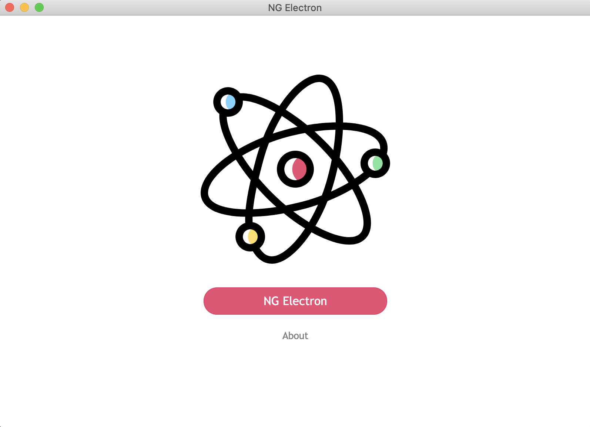
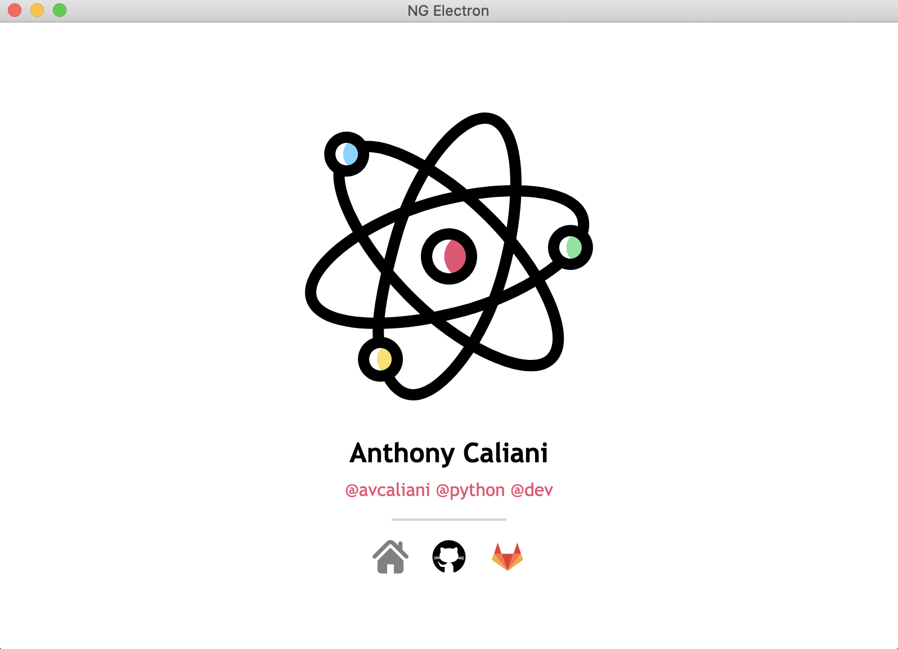

# ⚡️ NG Electron
By Anthony Vilarim Caliani

[](#) [](#) [](#) [](#)

Some experiments using _Angular_, _Electron_ and _Python_!

## Quick Start

> 👉 Before start using electron make sure that you have already executed `postinstall` script which is located at `package.json`.

```sh
# First install local dependencies...
yarn && yarn postinstall

# Start App
yarn electron
```

### Debug Mode
```bash
ng serve
yarn electron:serve  # Open another terminal window and run this
```

## Screenshots

### 🏠 Home


### 🐍 After Python Process

